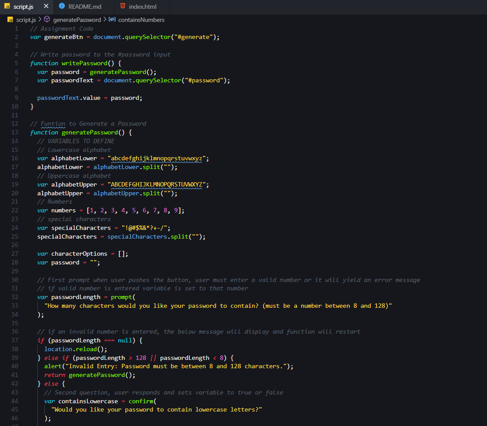

# Password Generator
The purpose of this repository is to create a random password generator which takes the user defined parameters and returns a random value within those parameters.

## Table of Contents
* [Installation](#installation)
* [Usage](#Usage)
* [Building the Password Generator](#building-the-password-generator)
* [Acceptance Criteria](#acceptance-criteria)
* [Credits](#credits)
* [Badges](#badges)
* [Links](#Links)
* [License](#license)

-----

## Installation
1. Follow the GitHub Repository Link in the [Links](#Links) section below.
1. Clone the repository using an SSH key.
1. Open GitBash and use "git clone" to clone the repository.

-----

## Usage
Edit using VSCode after [installation](#installation). HTML and CSS files are provided.

#### Javascript

-----

## Building the Password Generator

The first challenge with building the password generator was creating a series of questions for the user to compile the desired parameters for their password. This was accomplished with a series of prompts requesting information or confirmations from the user. If at any point during these questions the user enters an invalid response, an error message will appear and the questions will start from the beginning. If the user choses to decline the first prompt (password length), the page will reload.

Once all of the prompts were built, the second challenge of building the password generator began - actually generating a password. Using all of the parameters given by the user, I then created a series of if statements that would add the characters selected to an array for the computer to choose from. After this array was completed, I created a for loop, that would randomly select a character from the array for the alloted number of characters chosen by the user.

Overall I found this assignment to be very challenging but in the end it really solidified my base knowledge of functions and gave me a much better understanding of the sequence of events within a function.

-----

## Acceptance Criteria

* GIVEN I need a new, secure password :heavy_check_mark:
* WHEN I click the button to generate a password :heavy_check_mark:
* THEN I am presented with a series of prompts for password criteria :heavy_check_mark:
* WHEN prompted for password criteria :heavy_check_mark:
* THEN I select which criteria to include in the password :heavy_check_mark:
* WHEN prompted for the length of the password :heavy_check_mark:
* THEN I choose a length of at least 8 characters and no more than 128 characters :heavy_check_mark:
* WHEN prompted for character types to include in the password :heavy_check_mark:
* THEN I choose lowercase, uppercase, numeric, and/or special characters :heavy_check_mark:
* WHEN I answer each prompt :heavy_check_mark:
* THEN my input should be validated and at least one character type should be selected :heavy_check_mark:
* WHEN all prompts are answered :heavy_check_mark:
* THEN a password is generated that matches the selected criteria :heavy_check_mark:
* WHEN the password is generated :heavy_check_mark:
* THEN the password is either displayed in an alert or written to the page :heavy_check_mark:

-----

## Credits
I am extremely grateful for my tutor Michell Brito who very patiently helped me think through my problems and brainstorm a solution.

Reources:

* [w3schools](https://www.w3schools.com)
* [Location Reload](https://www.w3schools.com/jsref/met_loc_reload.asp)

-----

## Badges

-----

## Links
[Repository Link](https://github.com/aimeecesler/password-generator)

[Deployed Application](https://aimeecesler.github.io/password-generator/)

-----

## License
Copyright &copy; [2020] [Aimee Corbin Esler]

Permission is hereby granted, free of charge, to any person obtaining a copy
of this software and associated documentation files (the "Software"), to deal
in the Software without restriction, including without limitation the rights
to use, copy, modify, merge, publish, distribute, sublicense, and/or sell
copies of the Software, and to permit persons to whom the Software is
furnished to do so, subject to the following conditions:

The above copyright notice and this permission notice shall be included in all
copies or substantial portions of the Software.

THE SOFTWARE IS PROVIDED "AS IS", WITHOUT WARRANTY OF ANY KIND, EXPRESS OR
IMPLIED, INCLUDING BUT NOT LIMITED TO THE WARRANTIES OF MERCHANTABILITY,
FITNESS FOR A PARTICULAR PURPOSE AND NONINFRINGEMENT. IN NO EVENT SHALL THE
AUTHORS OR COPYRIGHT HOLDERS BE LIABLE FOR ANY CLAIM, DAMAGES OR OTHER
LIABILITY, WHETHER IN AN ACTION OF CONTRACT, TORT OR OTHERWISE, ARISING FROM,
OUT OF OR IN CONNECTION WITH THE SOFTWARE OR THE USE OR OTHER DEALINGS IN THE
SOFTWARE.